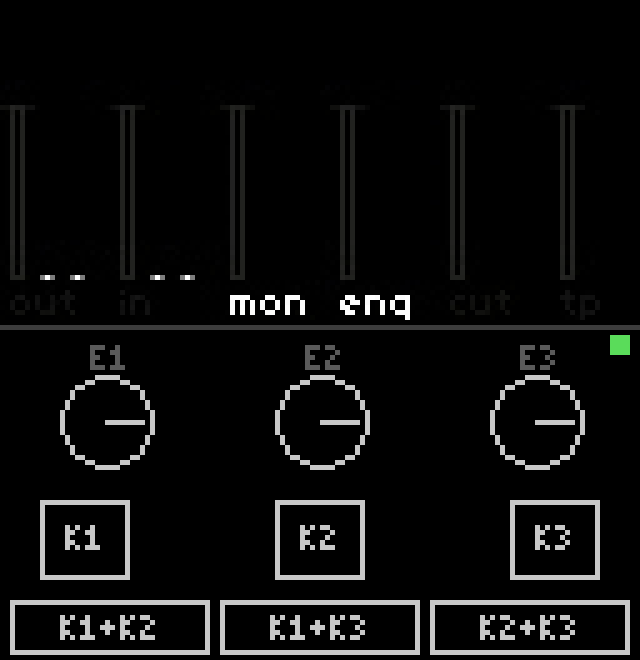

# nornscope

Remote screen + control for the [monome norns](https://monome.org/docs/norns/).
Watch the norns screen live in a desktop window and operate its three keys and
three encoders with the mouse — works with **any** script, no script-side
support needed.



## How it works

- **Video out:** the norns streams its 128×64 screen over the network via
  [ndi-mod](https://github.com/Dewb/ndi-mod) (NDI protocol). nornscope receives
  it with the official NDI SDK and renders it in a resizable window.
- **Control in:** key and encoder events are injected through matron's
  websocket REPL (`ws://<norns>:5555`, the same channel the maiden editor
  uses) by evaluating `_norns.key(n,z)` / `_norns.enc(n,d)` — the exact
  dispatch functions matron calls for physical hardware input. This makes it
  fully generic: scripts, system menus, everything responds as if you touched
  the device.
- **Feedback:** the mod wraps `_norns.key` / `_norns.enc` and prints tagged
  lines (`NSQ key 2 1`, …) on the same websocket bus, which matron broadcasts
  to all connected clients. nornscope parses them and lights up its on-screen
  controls when the real hardware is touched. nornscope's own injections set
  a Lua flag first (`nornscope_remote=true`) so they don't echo back.

## Features

- Live screen view in a resizable window
- **K1 / K2 / K3** — click to tap; press and drag off the button to leave it
  held ("sticky"); click again to release. Combos are played the way the
  hardware encourages: stick K1 like a Shift key, then tap K2/K3.
- **E1 / E2 / E3** — hover and scroll; 3 wheel ticks per encoder detent so
  values don't fly off (`WHEEL_PER_DETENT`)
- **Physical input indicators** — press a real key or turn a real encoder on
  the norns and the on-screen control lights up amber (knobs also track the
  turn); requires the `norns/mod.lua` patch below
- Connection status dot (green = control channel live, red = dropped)
- **Self-healing connections:** the control channel heartbeats every 3 s and
  reconnects when replies stop, and the video receiver re-runs discovery after
  10 s without frames — a norns reboot recovers by itself within ~15 s
- Every key/encoder injection is logged with the exact Lua sent; send failures
  are marked loudly
- All keys released on exit so the device is never left with a stuck key
- Control host auto-derived from the NDI source address — zero config

## Requirements

**Desktop (Linux; developed on Fedora):**
- g++, SDL2 (`SDL2-devel`), pkg-config
- [NDI SDK v6 for Linux](https://downloads.ndi.tv/SDK/NDI_SDK_Linux/Install_NDI_SDK_v6_Linux.tar.gz)
  (free, license-restricted — not vendored here)
- Same LAN/subnet as the norns (NDI discovery uses mDNS)

**Norns:**
- [ndi-mod](https://github.com/Dewb/ndi-mod) installed and enabled
  (SYSTEM > MODS, then SYSTEM > RESTART)
- Recommended: the menu-mode streaming patch below

## Build

```sh
# download and unpack the NDI SDK, then symlink it into the repo:
ln -s "/path/to/NDI SDK for Linux" ndi-sdk
make
```

### Windows (cross-compile from Linux)

Requires `mingw64-gcc-c++` and the official
[SDL2 mingw development package](https://github.com/libsdl-org/SDL/releases)
unpacked under `sdl2-mingw/`:

```sh
make windows        # -> nornscope.exe, ndi_grab.exe
make dist-windows   # -> dist/nornscope-windows-x64.zip (exes + required DLLs)
```

The Windows build loads NDI dynamically at runtime, so **no NDI SDK is needed
to build or run it** — but the Windows machine must have the
[NDI Runtime 6](https://ndi.link/NDIRedistV6) installed (same requirement as
OBS DistroAV; if you have that, you're set). All other dependencies
(SDL2.dll, libwinpthread) are included in the zip.

## Norns-side setup

1. Install ndi-mod from the maiden console:
   ```
   ;install https://github.com/Dewb/ndi-mod/releases/latest/download/ndi-mod.zip
   ```
2. Enable it: SYSTEM > MODS > NDI-MOD (enc 3 to add `+`), then SYSTEM > RESTART.

### Norns-side patch (recommended)

Stock ndi-mod only pushes a frame when the *script* redraws, so the NDI stream
freezes on the last script frame whenever you enter the system menu (K1).
`norns/mod.lua` is a drop-in replacement for
`~/dust/code/ndi-mod/lib/mod.lua` that:

1. adds a 15 Hz metro calling `ndi_mod.update()` unconditionally, so menus
   stream too (it re-arms after script reloads — norns frees all metros on
   script change), and
2. wraps `_norns.key` / `_norns.enc` to report physical input to nornscope
   (the indicator feature above). The tagged lines also show up in the
   maiden console — filter on `NSQ` if you want to watch them.

## Usage

```sh
./nornscope           # connect to first NDI source matching "NORNS"
./nornscope MySource  # match a different source name substring
```

Helpers:

```sh
./ndi_grab                          # CLI: discover, grab one frame -> /tmp/norns_ndi.ppm
python3 tools/ws_send.py '<lua>'    # one-off commands on the matron REPL (fire and forget)
python3 tools/ws_q.py '<lua>'       # same, but prints matron's reply
```

`ws_send.py` examples:

```sh
python3 tools/ws_send.py '_norns.key(3,1)' '_norns.key(3,0)'   # tap K3
python3 tools/ws_send.py '_norns.enc(1,-2)'                      # E1 CCW 2
python3 tools/ws_q.py 'print(norns.menu.status())'               # query, see the answer
```

## Troubleshooting

- **Firewall:** open mDNS and the NDI port range on the desktop, e.g. firewalld:
  ```sh
  sudo firewall-cmd --permanent --add-service=mdns
  sudo firewall-cmd --permanent --add-port=5960-5989/tcp --add-port=5960-5989/udp
  sudo firewall-cmd --reload
  ```
- **OBS instead of a dedicated viewer:** OBS + DistroAV works too. On Flathub,
  DistroAV 6.x discovers sources through the host Avahi daemon and the sandbox
  blocks it by default — fix with:
  ```sh
  flatpak override --user --system-talk-name=org.freedesktop.Avahi com.obsproject.Studio
  ```
- **Keys stop reaching the norns (e.g. after it reboots):** the viewer should
  recover on its own within ~15 s (heartbeat + reconnect). If the status dot
  stays red, check the log on stderr — every injected event is logged as
  `sent: <lua>`, with `(FAILED)` on errors.
- **Flaky stream on recent norns OS:** the 60 Hz display refresh change broke
  ndi-mod for some users; norns update 2.9.4 (2026-01) shipped a screen-context
  fix for it. Keep the norns updated.

## Repo layout

```
src/nornscope.cpp  GUI viewer + remote control (SDL2 + NDI SDK + ws REPL)
src/ndi_grab.cpp   single-frame CLI grabber / connectivity test
src/ndi_loader.h   runtime NDI loading (dynamic DLL resolution on Windows)
tools/ws_send.py   minimal stdlib websocket client for the matron REPL
tools/ws_q.py      same, printing matron's replies
norns/mod.lua      ndi-mod patch: stream system menus too + report physical input
Makefile           native + mingw cross-build (set NDI_SDK=, SDL2_MINGW=)
```

## License

[MIT](LICENSE) — use it for anything, just keep the copyright notice.

## Credits

- [Dewb/ndi-mod](https://github.com/Dewb/ndi-mod) — the norns-side NDI sender
- NDI® is a trademark of Vizrt/NewTek; the NDI SDK is used under its license
- [monome norns](https://github.com/monome/norns)
